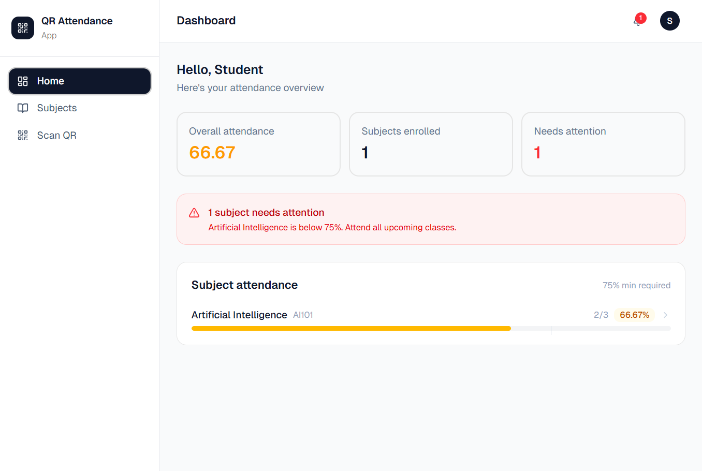
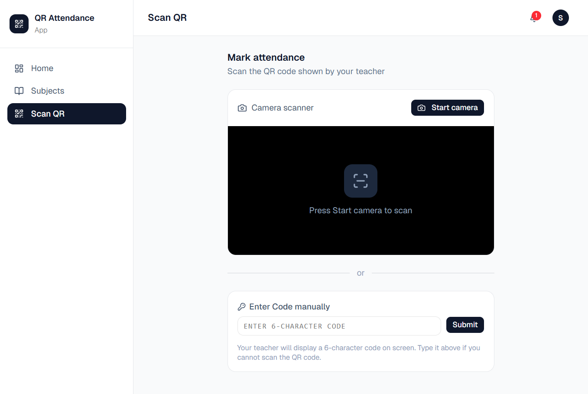
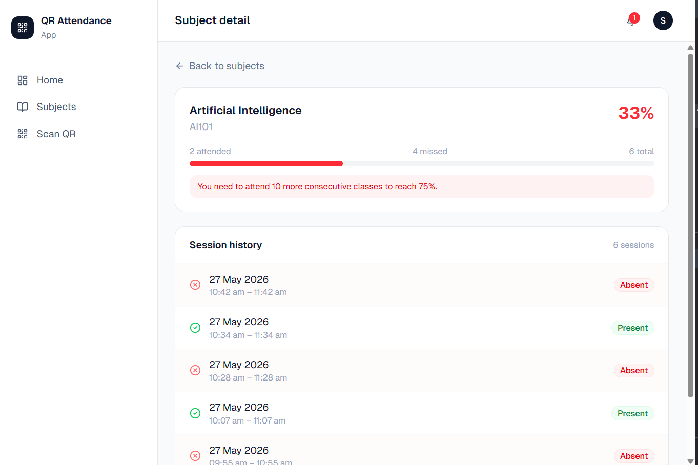
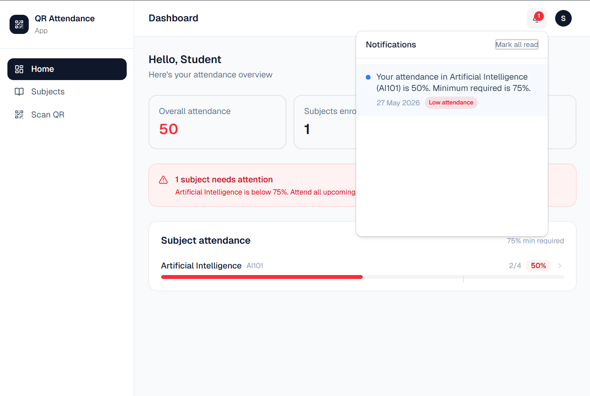
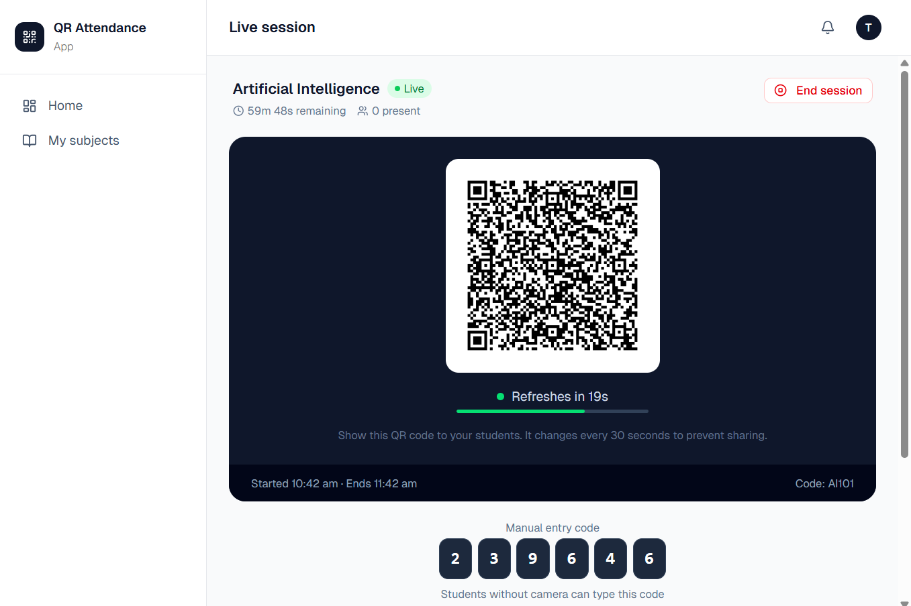
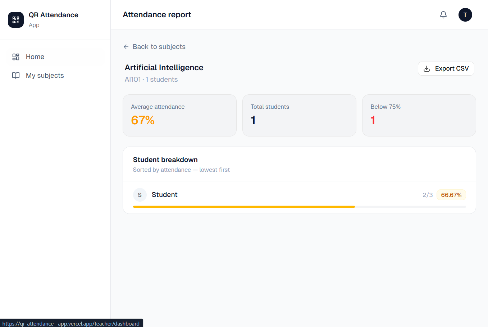
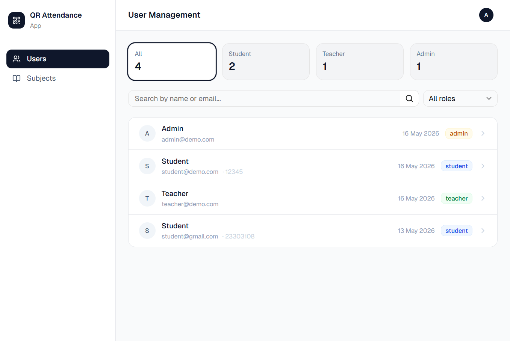
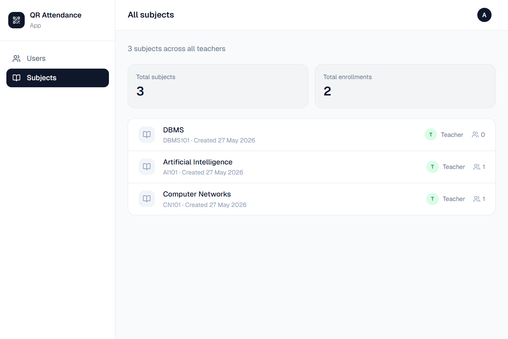

# QR Attendance App

> **Built to replace paper registers.** Teachers generate a QR code that rotates every 30 seconds — students scan to mark attendance instantly. Proxy attendance is blocked because the code expires before it can be shared.


<br/><br/>

🚀 **[Live Demo](https://your-live-url.vercel.app)** &nbsp;·&nbsp; 📡 **[Backend API](https://your-api-url.onrender.com/health)**

> ⚠️ The backend is hosted on Render's free tier — it may take **10–15 seconds to wake up** on first request. Subsequent requests are fast.

---

## Screenshots

### 🎓 Student

 

 

### 👨‍🏫 Teacher

 

### 🛡️ Admin

 

> 💡 **Tip for reviewers:** Use the demo credentials below to try the full flow — no sign-up needed.

---

## Demo Credentials

| Role    | Email            | Password    |
| ------- | ---------------- | ----------- |
| Teacher | teacher@demo.com | Teacher@123 |
| Student | student@demo.com | Student@123 |
| Admin   | admin@demo.com   | Admin@123   |

---

## What Problem Does This Solve?

Traditional paper attendance has three core problems:

- **Slow** — calling names or signing sheets wastes 5–10 minutes per class
- **Proxy-prone** — a friend can sign for an absent student
- **Hard to analyse** — manual sheets don't give percentage breakdowns or alerts

This app solves all three. The rotating QR code is the key insight: even if a student screenshots the code and shares it on WhatsApp, the code expires in 30 seconds — long before a proxy can use it.

---

## Features

### 👨‍🏫 Teacher

- Create subjects with a unique enrollment code
- Start an attendance session with a configurable duration
- QR code auto-rotates every **30 seconds** — blocks proxy attendance
- **6-character manual code** displayed alongside QR (fallback for students without a camera)
- Live view of which students have marked attendance
- End session early at any time
- View attendance report per subject — percentage per student
- Export attendance as **CSV**

### 👨‍🎓 Student

- Enroll in subjects using a teacher-provided code
- Mark attendance by scanning QR code via phone camera
- Manual code entry as fallback
- Dashboard showing attendance percentage per subject
- Session-by-session history — present or absent for every class
- **Low attendance alert** when percentage drops below 75%

### 🛡️ Admin

- View, search, and filter all users by role
- Edit any user's profile — name, email, role, roll number
- Delete users — automatically cleans up enrollments and subjects
- View all subjects across all teachers

### ⚙️ System

- Automated **email alert** via Resend when student attendance drops below 75%
- In-app notifications with unread count badge
- JWT authentication with **refresh token rotation**
- Role-based route protection — student, teacher, admin
- Fully responsive — works on mobile and desktop

---

## How the Rotating QR Works

```
Teacher starts session
        ↓
Server generates QR token + 6-char manual code
QR token expires in 30 seconds
        ↓
Teacher screen shows QR image + manual code + countdown timer
        ↓
Student scans QR or types manual code
Server validates token → checks enrollment → saves attendance record
        ↓
Every 30 seconds:
  — New QR token generated
  — Old token immediately invalidated
  — Proxy via screenshot or WhatsApp is blocked
```

**Why this works:** The window between a student screenshotting the code and sharing it is longer than 30 seconds in any realistic scenario — group chat lag, recipient opening the app, camera focus — the token is already dead.

---

## Tech Stack

| Layer      | Technology                                       |
| ---------- | ------------------------------------------------ |
| Frontend   | React 18, TypeScript, Vite                       |
| Styling    | Tailwind CSS, shadcn/ui                          |
| State      | Zustand (auth), TanStack Query (server state)    |
| Forms      | React Hook Form + Zod                            |
| Backend    | Node.js, Express, TypeScript                     |
| Database   | MongoDB, Mongoose                                |
| Auth       | JWT (access + refresh tokens), bcrypt            |
| Email      | Resend                                           |
| QR Code    | `qrcode` (generation), `html5-qrcode` (scanning) |
| Deployment | Vercel (frontend), Render (backend), Atlas (DB)  |

---

## Architecture

```
client/                     # React frontend
├── src/
│   ├── api/                # Axios API layer per feature
│   ├── components/         # Shared UI components + layouts
│   ├── config/             # Axios and Query Client configuration
│   ├── hooks/              # Custom hooks (QR scanner, session timer)
│   ├── pages/              # Pages per role (student/teacher/admin)
│   ├── store/              # Zustand auth store
│   ├── types/              # TypeScript interfaces
│   ├── schemas/            # Zod validation schemas
│   ├── routes/             # React Router with protected routes
│   └── utils/              # Utility functions

server/                     # Node.js backend
├── src/
│   ├── config/             # Database connection
│   ├── constants/          # Status codes, paths
│   ├── controllers/        # Request handlers
│   ├── emails/             # Email templates
│   ├── middleware/         # Auth, roles, error handler, security
│   ├── models/             # Mongoose models
│   ├── routes/             # Express routers
│   ├── schemas/            # Zod validation schemas
│   ├── services/           # Business logic layer
│   ├── types/              # TypeScript types
│   └── utils/              # JWT, cookies, QR, email helpers
```

---

## Local Setup

### Prerequisites

- Node.js 18+
- MongoDB running locally or an [Atlas](https://www.mongodb.com/atlas) connection string
- [Resend](https://resend.com) account for email (free tier is sufficient)

### 1. Clone the repo

```bash
git clone https://github.com/gurwindersingh777/qr-attendance-app.git
cd qr-attendance-app
```

### 2. Setup the backend

```bash
cd server
npm install
cp .env.example .env
# Fill in your values in .env
npm run dev
```

### 3. Setup the frontend

```bash
cd client
npm install
cp .env.example .env
# Leave VITE_API_URL empty for local dev — it defaults to localhost:4000
npm run dev
```

### 4. Open the app

| Service  | URL                          |
| -------- | ---------------------------- |
| Frontend | http://localhost:5173        |
| Backend  | http://localhost:4000/health |

---

## API Overview

| Method | Route                            | Access  | Description                 |
| ------ | -------------------------------- | ------- | --------------------------- |
| POST   | `/auth/register`                 | Public  | Create account              |
| POST   | `/auth/login`                    | Public  | Login                       |
| POST   | `/subject`                       | Teacher | Create subject              |
| POST   | `/subject/enroll`                | Student | Enroll by code              |
| POST   | `/session/start`                 | Teacher | Start session + generate QR |
| GET    | `/session/:sessionId/qr`         | Teacher | Rotate QR token             |
| POST   | `/session/mark`                  | Student | Mark attendance             |
| GET    | `/attendance/summary`            | Student | My attendance %             |
| GET    | `/attendance/report/subject/:id` | Teacher | All students report         |
| GET    | `/admin/users`                   | Admin   | All users                   |
| GET    | `/notification`                  | Any     | My notifications            |

---

## Security

- JWT access tokens expire in **1 day** — refresh tokens in **7 days**
- **Refresh token rotation** — old token invalidated on every refresh
- **Rate limiting** — 10 attempts per 15 min on auth routes
- **Helmet** — 15+ HTTP security headers set automatically
- Request body limited to **10kb**
- Passwords hashed with **bcrypt** (10 rounds)
- Role-based middleware on every protected route

---

## Challenges & What I Learned

**Token expiry race conditions** — When the QR token rotated exactly as a student was submitting, requests would fail with a false "invalid token" error. I solved this with a short overlap window: the server accepts the previous token for 2 seconds after rotation, making the UX seamless without meaningfully reducing security.

**Refresh token rotation** — Implementing silent token refresh with Axios interceptors while avoiding request queuing bugs taught me a lot about how auth flows work in production apps — race conditions when multiple requests fire simultaneously before a token is refreshed required a pending-promise pattern.

**Role-based architecture** — Designing a single Express backend that serves three completely different user experiences (student/teacher/admin) cleanly required thinking carefully about middleware layering and service separation early on.

---

## Deployment

| Service       | Purpose          | Notes                           |
| ------------- | ---------------- | ------------------------------- |
| Vercel        | Frontend hosting | Auto-deploys on push to `main`  |
| Render        | Backend hosting  | Free tier — cold starts ~10–15s |
| MongoDB Atlas | Database         | M0 free cluster                 |
| Resend        | Email delivery   | Free tier (3,000 emails/month)  |

---

## Author

**Gurwinder Singh**
[GitHub](https://github.com/gurwindersingh777)


